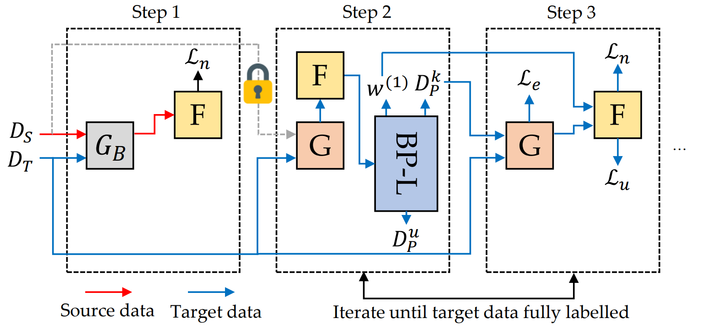

# SF-PGL


This work is the official Pytorch implementation of our papers:

**Source-Free Progressive Graph Learning for
Open-Set Domain Adaptation**  
[__***Yadan Luo***__](https://sites.google.com/view/yadanluo/), Zijian Wang, Zhuoxiao Chen, Zi Huang, Mahsa Baktashmotlagh  
[*Submission to Transcations on Pattern Analysis and Machine Intelligence (TPAMI)*]() 


**Progressive Graph Learning for Open-Set Domain Adaptation**  
[__***Yadan Luo^***__](https://sites.google.com/view/yadanluo/), Zijian Wang^, Zi Huang, Mahsa Baktashmotlagh  
[*International Conference on Machine Learning (ICML) 2020*](http://proceedings.mlr.press/v119/luo20b.html)  
[[Paper](http://proceedings.mlr.press/v119/luo20b.html)] [Code](https://github.com/BUserName/PGL)]

-----
## Framework
To further handle a more realistic yet challenging source-free setting, a novel SF-PGL framework was proposed, which leverages a balanced pseudo-labeling regime to enable uncertainty-aware progressive learning without relying on any distribution matching or adversarial learning methods. 
As an extension of PGL, we have significantly extended the idea of open-set domain adaptation from the unsupervised learning case to the source-free and semi-supervised settings, from image classification to action recognition, where the complex data interaction and more significant domain gap are addressed. We further discussed a hitherto untouched aspect of OSDA model - the model calibration issue. Experimental results evidenced that the SF-PGL can alleviate the class imbalance introduced by pseudo-labeled sets so that the overconfidence and under-confidence of the OSDA model can be avoided.

<p align="center">

</p>

----
## Contents
* [Requirements](#requirements)
* [Dataset Preparation](#dataset-preparation)
  * [Data structure](#data-structure)
  * [File lists for training/validation](#file-lists-for-trainingvalidation)
  * [Input data](#input-data)
* [Usage](#usage)
  * [Training](#training)
  * [Testing](#testing)
<!--   * [Video Demo](#video-demo) -->
* [Options](#options)
  * [Domain Adaptation](#domain-adaptation)
  * [More options](#more-options)
* [Citation](#citation)
* [Contact](#contact)

## Requirements
- Python 3.6
- Pytorch 1.3


### Datasets
The links of datasets will be released afterwards,
- Syn2Real-O (VisDA-18)
- VisDA-17
- Office-home


### Training
The general command for training is,
```
python3 train.py
```
Change arguments for different experiments:
- dataset: "home" / "visda" / "visda18"
- batch_size: mini_batch size
- beta: The ratio of known target sample and Unk target sample in the pseudo label set
- EF : Enlarging Factor α
- num_layers: GNN's depth
- adv_coeff: adversarial loss coefficient γ
- node_loss: node classification loss μ
For the detailed hyper-parameters setting for each dataset, please refer to Section 5.2 and Appendix 3.  

Remember to change dataset_root to suit your own case

The training loss and validation accuracy will be automatically saved in './logs/', which can be visualized with tensorboard.
The model weights will be saved in './checkpoints'


